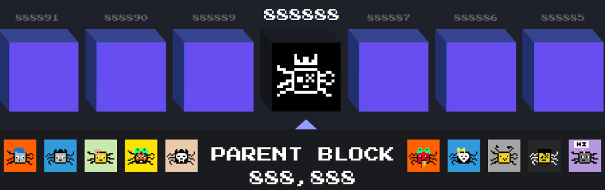

---

# BTC FLEAS Tokenomics

> 🎨 **All artwork in BTC Fleas was created by C8Y Labs — an 8-year-old artist and daughter of an Ordinals collector.**

$TOKEN_TBC is the official token of the BTC Fleas ecosystem — a pixelated plague on Bitcoin.  
This token is built to reward flea holders, stakers, and community builders.  
It will launch as a BRC-2.0 token in partnership with [BestInSlot.xyz](https://bestinslot.xyz).

We began building a tight OG group on X and are now migrating members to Discord,  
where access is gated by holding one of only **88 OG Flea Passes**.  
These OG passes qualify for all the perks of the upcoming **800 General Flea Passes** — and more.  
As of now, **30/88 OG Passes have already been allocated**.  
Mint yours at [OrdinalGenesis.xyz](https://ordinalgenesis.xyz/mint/btc-fleas).

## Token Info
- Total Supply: 888,888,888
- Ticker: $TOKEN_TBC
- Chain: BRC‑2.0

---

## 🗺️ BTC Fleas Launch Roadmap

### 📌 Phase 0: Foundations (Completed Launch Prep)

| Phase   | Task                                               | Status     | Notes                                                                 |
|---------|----------------------------------------------------|------------|------------------------------------------------------------------------|
| Phase 0 | Created all 888 flea artworks by C8Y Labs          | Complete   | Designed by an 8-year-old artist — daughter of an Ordinals collector   |
| Phase 0 | Inscribed parent inscription on Block 888,888      | Complete   | Symbolic provenance marking Pizza Sats + infinite recursion            |
| Phase 0 | Inscribed all 888 BTC Fleas                        | Complete   | 24×24 pixel bugs on Pizza Sats, all minted and held securely           |
| Phase 0 | Finalized pixel‑art traits and metadata            | Complete   | Unique layered traits and rarity logic ready for reveal                |
| Phase 0 | Built out brand identity and narrative             | Complete   | C8Y Labs artwork, “itch” theme, meme‑driven storyline                  |
| Phase 0 | Launched public website (btcfleas.xyz)             | Complete   | Project overview, dynamic emergences, and visual hub                   |
| Phase 0 | Completed tokenomics and GitHub token repo         | Complete   | $TOKEN_TBC model live with total supply, CSV, staking, bonding curve      |
| Phase 0 | Partnered with BestInSlot.xyz for $ITCHIN token launch | Complete   | $TOKEN_TBC will launch as a BRC-2.0 token through BiS with full support   |

---

### 🚀 Phase 1–4 Launch Steps

| 🧱 Phase | Task                                                   | Status       | Notes                                                               |
|---------|--------------------------------------------------------|--------------|----------------------------------------------------------------------|
| Phase 1 | Launch 800 General + 88 OG FLEA Passes on Ordinal Genesis | In Progress  | OGs get all perks + extras — 30/88 already allocated                |
| Phase 2 | Airdrop 888 BTC Fleas to FLEA Pass holders             | To Do        | On pizza satoshis, snapshot after mint                              |
| Phase 3 | Set up Best In Slots staking + point tracking          | To Do        | 1 point/block per locked flea                                       |
| Phase 3 | Develop $ITCHIN claim dashboard                        | To Do        | Optional UI for claiming rewards                                    |
| Phase 4 | Launch teaser campaign on X                            | In Progress  | Memes, mint teasers, vibes                                          |
| Phase 4 | Design Flea market or game utility concept             | To Do        | “Flea Jump” or merch store                                          |
| Meta    | Publish GitHub repo with tokenomics                    | Complete     | `BTCFLEAS-tokenomics` repo live                                       |
| Meta    | Add custom branding, banner, and badge row             | Complete     | Added to README                                                     |
| Meta    | Publish full roadmap in README                         | Complete     | Includes all phases + JSON + table                                  |
