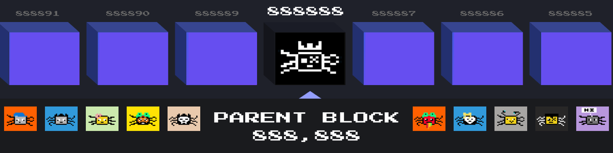

---

# $ITCHIN Tokenomics

$ITCHIN is the official token of the BTC Fleas ecosystem — a pixelated plague on Bitcoin.
This token is built to reward flea holders, stakers, and community builders.

## Token Info
- Total Supply: 888,888,888
- Ticker: $ITCHIN
- Chain: BRC-2.0
